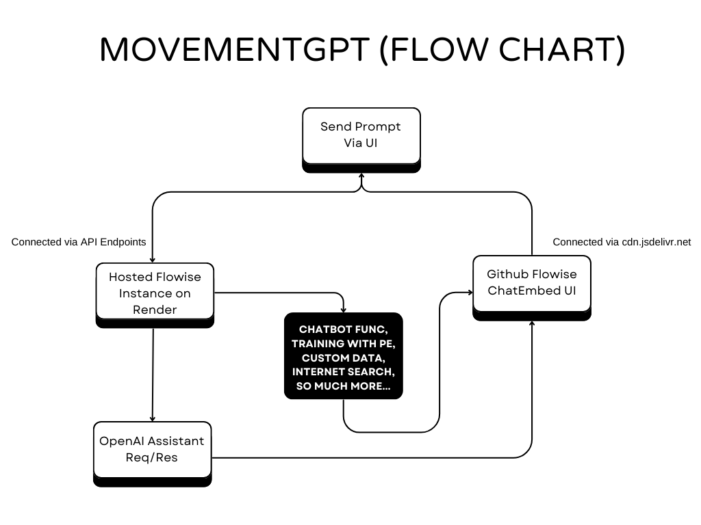
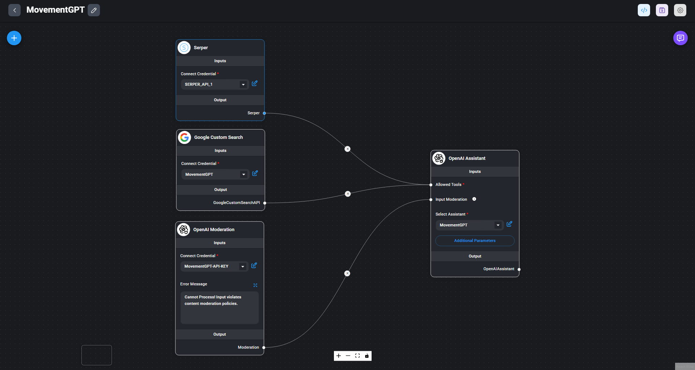

# MovementGPT - Smart AI Assistant for Web3 Developers to build on Movement Blockchain and It's Ecosystem 🤖

**➡️ This project is a submission to the Movement Labs Hackathon 👨‍💻**

 

 <strong> ✨ MovementGPT 🔥 </strong> 

 

## Project Overview

***MovementGPT*** is a highly trained assistant that provides in-depth insights about the Movement Blockchain and its ecosystem products. It answers queries with precision, making complex Movement topics accessible to **newcomers, researchers, enthusiasts, and developers.**  

MovementGPT assists developers in building dapps on the Movement Blockchain using the Move Programming Language for smart contract development through a conversational UI, powered by **OpenAI Assistants, GPT-4o model, and the latest tech-stack.**  

It helps developers code, fix, and test their smart contracts written in Move to build web3 applications on Movement. Simply enter a prompt in the UI to get accurate answers. Specially designed for the Movement community of developers and ecosystem products, MovementGPT was developed by Asharib Ali as a submission for the **"Movement Labs Hackathon"**  

**MovementGPT** offers many great features to help developers build and ship quickly on **Movement Blockchain.**  

## Problem Statement with Solution

Developers want to build on Movement but lack an interactive way to quickly and easily create full-stack web3 applications. They might use ChatGPT, but it's trained on outdated data and doesn't know about the latest developments. Plus, GPT Plus costs $20 per month. That's why we need a platform/chatbot to address this issue: "Help developers write, fix, and test their smart contracts in Move for the Movement Blockchain" in a conversational way. I have trained it on a massive amount of Movement Codebase & Ecosystem products, and projects data for building on Movement and have prompt-engineered it to achieve the best results.

## Features

🎯 Personalized answers for community & developers.  
🕒 Real-time updates from Internet.  
👨‍💻 Chat via CUI (Conversational User Interface).  
🎤 Voice functionality for easy interaction.  
👍 Provide Feedback.  
☑️12 Limit Messages per 24 hours.  

## Benefits

🌟 Enhances developer experience.  
📰 Keeps the Movement community informed.  
🌐 Makes Movement more accessible.  
📈 Assist greater engagement and project development.  

## Tech Stack

- **OpenAI Assistant APIs**: Powers the natural language processing abilities to deliver accurate responses and maintain a conversational style with (function calling, code interpreter, and file search).
- **FlowiseAI**: Customized LLM orchestration flow tool.
- **Next.js, TypeScript, TailwindCSS**: Provides a seamless, dynamic user interface with a consistent design.
- **OpenAI GPT-4o and Moderation APIs**: Handles advanced chatbot responses and content moderation.
- **Google Custom Search API**: Allows the chatbot to fetch relevant information online to provide up-to-date answers.
- **Custom Training Data with Prompt Engineering**: Ensures precise responses through well-crafted prompts and curated data.
- **OpenAI Whisper API for Speech-to-Text**: Supports speech recognition to deliver a multi-modal experience.
- **LangSmith API for Chatbot Analysis**: Analyzes chatbot interactions for optimization and refinement.

### **=> How Everything is Connected? (FlowChart)**

- [Flowise Github Repositry](https://github.com/AsharibAli/flowise) (Deployed on Render & Connected to Chatbot UI via APIs programmatically).
- [FlowiseChatEmbed Github Repositry](https://github.com/AsharibAli/FlowiseChatEmbed) (UI/UX of Chatbot, Connected via CDN)

### **=> (Behind the Scene) Flowise Flow Of MovementGPT**

## Potential Integration

I have built two versions of the MovementGPT, both have the same functionalities but one chatbot fixes in the full viewport of the screen and the other one is the pop-up version, both have the same functionality and are built with the same APIs, these chatbots can-be integrated into anywhere either on the complete subdomain of official website or the docs website but with the popup version.

- **[MovementGPT Full Version CodeBase](./movement-gpt/)**
- **[MovementGPT Popup Version CodeBase](./movement-gpt-popup/)**

### Live Hosted web app of MovementGPT

➡️ [Full Version Web App](https://movementgpt.vercel.app/)  
➡️ [Popup Version Web App](https://movementgpt-popup.vercel.app/)  

➡️ **[Prompt used for Assistant Training](./prompt-engineering/prompt.md)**  
➡️ **[Movement Books used for Assistant Training](./data/movement-books/)**  

## Future Improvements

**Expanded Knowledge Base:** Improve the ***MovementGPT*** by incorporating additional Movement Blockchain resources and Move programming language data to provide more comprehensive and technical answers. 

**Enhance Community Analytics:** Access real-time community sentiment about the Movement Blockchain and its ecosystem products through metrics from X and other social platforms for multiple use cases, such as in-depth technical, fundamental, and on-chain analysis of the $Movement Coin 

**OnChain AI Swap:** Effortlessly swap your Movement Coins and ecosystem tokens directly using a simple and intuitive prompt.